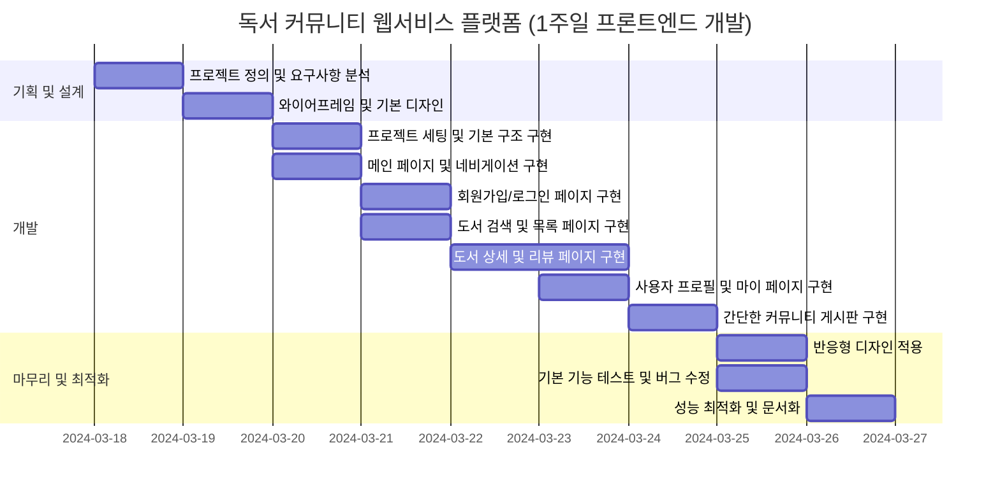

# Front_MiniProject_Library

## 1. 프로젝트 목표 및 범위
독서 목록 및 책 리뷰 커뮤니티 책 추천

가입 로그인 SNS로그인 프로필  댓글 대댓글 추천 인기순


1. 도서 관리

책 목록 관리
책 정보 제공
책 검색 기능
책 추천 시스템


2. 사용자 상호작용

리뷰 작성/수정/삭제
댓글 및 대댓글 기능
추천/비추천 기능
인기순 정렬 옵션


3. 커뮤니티 기능

독서 토론 게시판
독서 모임 개설/참여
책 관련 질문/답변


4. 사용자 계정

회원가입
로그인 (일반/SNS)
프로필 관리
독서 활동 기록


5. 추천 시스템

개인화된 책 추천
인기 도서 추천
유사 독자 추천


6. 소셜 기능

팔로우/팔로잉
독서 활동 공유
친구와 책 추천 주고받기


이 구조는 독서 커뮤니티 플랫폼의 주요 기능들을 포괄하며, 사용자들이 책을 중심으로 소통하고 정보를 공유할 수 있는 환경을 제공합니다. 각 항목은 세부적으로 더 확장될 수 있으며, 프로젝트의 구체적인 요구사항에 따라 조정될 수 있습니다. 독서 커뮤니티 플랫폼의 서비스 흐름도를 만들기 위해 다음과 같은 항목들을 고려할 수 있습니다:


정보 마인드맵

- 플랫폼:
책 정보 데이터베이스
사용자 관리 시스템
추천 알고리즘

- 이용자(독서 커뮤니티 회원):
회원가입/로그인
프로필 설정
책 검색 및 조회
리뷰 작성
커뮤니티 참여

- 협력 업체:
온라인 서점
출판사
도서관


- 금융 결제원:
결제 시스템 (책 구매 시)


* 서비스 흐름도:
메인 페이지
회원가입 및 로그인
책 정보 조회 및 검색
리뷰 작성 및 조회
커뮤니티 활동 (게시글 작성, 댓글)

추가할 예정 :책 추천 받기
책 구매 (온라인 서점 연계)
독서 활동 기록
소셜 기능 (팔로우, 공유)


* 화면리스트:

1. 최신 리뷰, 인기 도서, 추천 도서 등을 메인페이지

2. 회사소개

3. 회원가입/로그인 페이지 : SNS 로그인 옵션 포함

4. 도서 검색 및 목록 페이지 : 검색 기능과 카테고리별 도서 목록

5. 도서 상세 페이지 : 책 정보, 리뷰, 별점, 구매 링크 등

6. 사용자 프로필 페이지 : 개인 정보, 독서 활동 내역, 작성한 리뷰 목록
개인화된 책 추천, 독서 통계, 설정 등

7. 커뮤니티 게시판 페이지 : 독서 관련 토론, 질문/답변을 위한 게시판


## 2. 기술 스택 및 배포 환경

## 3. github repo, url 생성

## 4. WBS 작성 - 업무 분류 체계

## 5. 와이어프레임 작성


## 6. ERD 작성
```mermaid
Table Comment {
  id integer
  message integer
  author_id integer
  post_id integer
  created_at datetime
  updated_at datetime 
}

Table Users {
  id integer [primary key]
  username varchar
  email varchar
  password varchar
  created_at datetime
}

Table Posts {
  id integer [primary key]
  title varchar
  content text [note: 'Content of the post']
  author_id integer
  created_at datetime
  updated_at datetime
}

Table Tag {
  id integer [primary key]
  username varchar
}

Table PostTag {
  post_id integer [primary key]
  tag_id integer
}

Ref: Users.id < Posts.id // many-to-one

Ref: Users.id < Comment.author_id

Ref: Users.id < Comment.id

Ref: Posts.id > PostTag.post_id

Ref: Posts.id > Comment.post_id

Ref: PostTag.tag_id > Tag.id
```
## 7. 폴더구조

## 8. URL 구조 및 페이지별 상세
https://www.figma.com/board/uQgC5QwvT2TXbp6cSX77HN/BookClub?node-id=0-1&t=9sWGnsVHs9nRz3Mm-1

## 9. 느낀 점

## 10. 트러블슈팅
