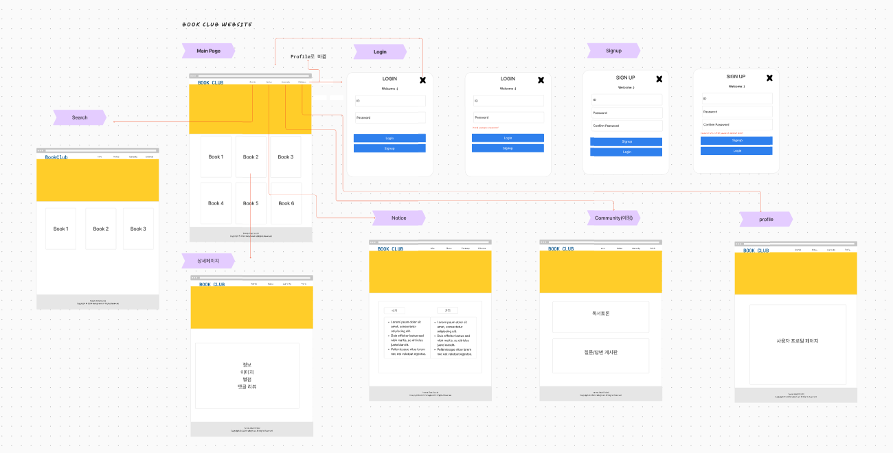
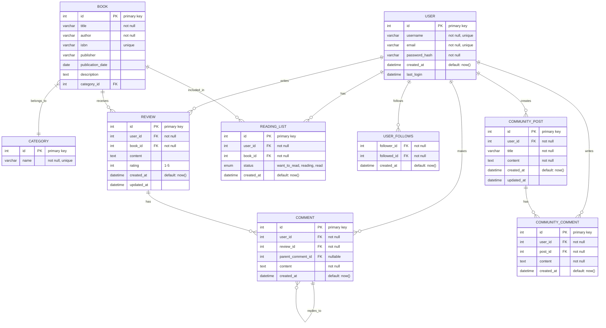

# Front_MiniProject_Library

## 1. 프로젝트 목표 및 범위
독서 커뮤니티 플랫폼으로 가입한 사용자들이 책을 중심으로 소통하고 정보를 공유할 수 있는 환경을 제공합니다.

독서 목록 및 책 리뷰 커뮤니티 책 추천

가입 로그인 SNS로그인 프로필  댓글 대댓글 추천 인기순


* 정보 마인드맵
```mermaid
flowchart LR
    classDef blue fill:#bbf,stroke:#f66,stroke-width:2px,color:white
    classDef yellow fill:#ff9,stroke:#f66,stroke-width:2px,color:black
    classDef green fill:#bfb,stroke:#f66,stroke-width:2px,color:black
    classDef red fill:#fbb,stroke:#f66,stroke-width:2px,color:black

    A((독서 커뮤니티<br>플랫폼)):::yellow

    A---->|플랫폼|B[책 정보 DB]:::blue
    A-->|플랫폼|B2[사용자 관리]:::blue
    A--->|플랫폼|B3[추천 알고리즘]:::blue

    A-.->|이용자|C((회원)):::green
    C===>|기능|C1[회원가입/로그인]
    C-->|기능|C2[프로필 설정]
    C-->|기능|C3[책 검색/조회]
    C-->|기능|C4[리뷰 작성]
    C-->|기능|C5[커뮤니티 참여]

    A----->|협력 업체|D>[협력사]:::red
    D-->|종류|D1[온라인 서점]
    D-->|종류|D2[출판사]
    D-->|종류|D3[도서관]

    A--금융-->E[(결제 시스템)]

    A--화면-->F{{메인 페이지}}
    A--화면-->F2{{회사 소개}}
    A--화면-->F3{{회원가입/로그인}}
    A--화면-->F4{{도서 검색/목록}}
    A--화면-->F5{{도서 상세}}
    A--화면-->F6{{사용자 프로필}}
    A--화면-->F7{{커뮤니티 게시판}}

    linkStyle 0 stroke:#f66,stroke-width:2px
    linkStyle 1 stroke:#f66,stroke-width:2px
    linkStyle 2 stroke:#f66,stroke-width:2px
    linkStyle 3 stroke:#0f0,stroke-width:2px
    linkStyle 8 stroke:#f00,stroke-width:2px

    click A "https://example.com/platform" "플랫폼 메인으로 이동"
    click C "https://example.com/user" "사용자 페이지로 이동"
    click D "https://example.com/partners" "협력사 정보 보기"

```

* 서비스 흐름도:
메인 페이지
회원가입 및 로그인
책 정보 조회 및 검색
리뷰 작성 및 조회
커뮤니티 활동 (게시글 작성, 댓글)

추가할 예정 :책 추천 받기
책 구매 (온라인 서점 연계)
독서 활동 기록
소셜 기능 (팔로우, 공유)


## 2. 기술 스택 및 배포 환경
Html/CSS JavaScript TypeScript Node.js

## 3. github repo, url 생성

## 4. WBS 작성 - 업무 분류 체계
```mermaid
gantt
title 독서 커뮤니티 웹서비스 플랫폼 (1주일 프론트엔드 개발)
dateFormat YY-MM-DD
section 기획 및 설계
프로젝트 정의 및 요구사항 분석 :2024-07-14, 1d
와이어프레임 및 기본 디자인 :2024-07-14, 1d
section 개발
프로젝트 세팅 및 기본 구조 구현 :2024-07-15, 1d
메인 페이지 및 네비게이션 구현 :2024-07-15, 1d
회원가입/로그인 페이지 구현 :2024-07-16, 1d
도서 검색 및 목록 페이지 구현 :2024-07-16, 1d
도서 상세 및 리뷰 페이지 구현 :2024-07-17, 2d
사용자 프로필 및 마이 페이지 구현 :2024-07-18, 1d
(추후예정) 간단한 커뮤니티 게시판 구현 
section 마무리 및 최적화
반응형 디자인 적용 :2024-07-19, 1d
기본 기능 테스트 및 버그 수정 :2024-07-20, 1d
성능 최적화 및 문서화 :2024-07-20, 1d
```

## 5. 와이어프레임 작성


| 도서 관리 | 사용자 상호작용 |
|-----------|-----------------|
| - 책 목록 관리<br>- 책 정보 제공<br>- 책 검색 기능<br>- 책 추천 시스템 | - 리뷰 작성/수정/삭제<br>- 댓글 및 대댓글 기능<br>- 추천/비추천 기능<br>- 인기순 정렬 옵션 |
| **커뮤니티 기능** | **사용자 계정** |
| - 독서 토론 게시판<br>- 독서 모임 개설/참여<br>- 책 관련 질문/답변 | - 회원가입<br>- 로그인 (일반/SNS)<br>- 프로필 관리<br>- 독서 활동 기록 |
| **추천 시스템** | **소셜 기능** |
| - 개인화된 책 추천<br>- 인기 도서 추천<br>- 유사 독자 추천 | - 팔로우/팔로잉<br>- 독서 활동 공유<br>- 친구와 책 추천 주고받기 |

## 6. ERD 작성

## 7. 폴더구조

## 8. URL 구조 및 페이지별 상세

* 화면리스트:
1. 최신 리뷰, 인기 도서, 추천 도서 등을 메인페이지
2. 회사소개
3. 회원가입/로그인 페이지 : SNS 로그인 옵션 포함
4. 도서 검색 및 목록 페이지 : 검색 기능과 카테고리별 도서 목록
5. 도서 상세 페이지 : 책 정보, 리뷰, 별점, 구매 링크 등
6. 사용자 프로필 페이지 : 개인 정보, 독서 활동 내역, 작성한 리뷰 목록
개인화된 책 추천, 독서 통계, 설정 등
7. 커뮤니티 게시판 페이지 : 독서 관련 토론, 질문/답변을 위한 게시판

## 9. 느낀 점

## 10. 트러블슈팅
