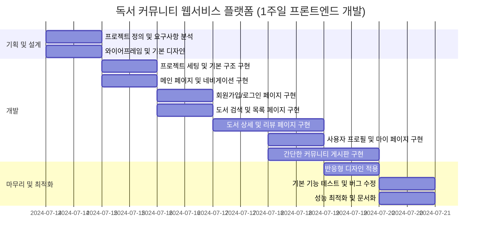
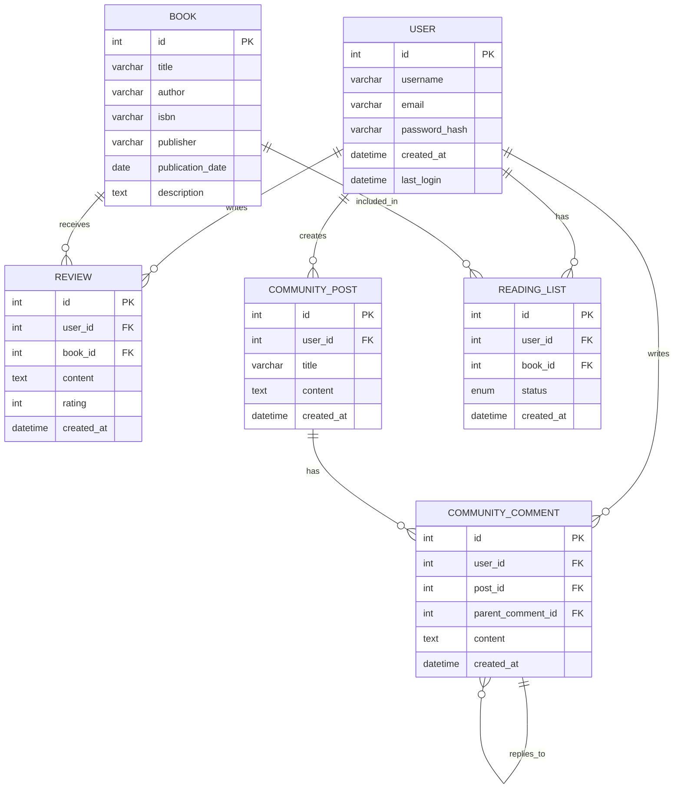

# Front_MiniProject_Library

프론트엔드 미니 프로젝트

## 1. 프로젝트 목표 및 범위

독서 커뮤니티 플랫폼으로 가입한 사용자들이 책을 중심으로 소통하고 정보를 공유할 수 있는 환경을 제공합니다. **BookClub** is a community for book lovers to discover, share, and discuss their favorite books.

"Read. Share. Connect."
This slogan incorporates key aspects of a book club:

- Reading books
- Sharing thoughts and reviews
- Connecting with others in the community

- 정보 마인드맵

- 서비스 흐름도: 
  메인 페이지 
  회원가입 및 로그인 
  책 정보 조회 및 검색 
  리뷰 작성 및 조회 
  독서 활동 기록 
  커뮤니티 활동 (게시글 작성, 댓글) 
  추가할 예정 :책 추천 받기 
  책 구매 (온라인 서점 연계) 
  소셜 기능 (팔로우, 공유) 

## 2. 기술 스택 및 배포 환경

Html/CSS | JavaScript | TypeScript | React | Bootstrap 

## 3. github repo, url 생성

Repo : https://github.com/helloghostt/Front_MiniPj_Library.git 

{ email: 'admin@book.club', role: 'admin' } 
{ email: 'user@book.club', role: 'user' } 

## 4. WBS 작성 - 업무 분류 체계

## 5. 와이어프레임 작성

| 도서 관리                                                              | 사용자 상호작용                                                                            |
| ---------------------------------------------------------------------- | ------------------------------------------------------------------------------------------ |
| - 책 목록 관리 - 책 정보 제공 - 책 검색 기능 - 책 추천 시스템 | - 리뷰 작성/수정/삭제 - 댓글 및 대댓글 기능 - 추천/비추천 기능 - 인기순 정렬 옵션 |
| **커뮤니티 기능**                                                      | **사용자 계정**                                                                            |
| - 독서 토론 게시판 - 독서 모임 개설/참여 - 책 관련 질문/답변     | - 회원가입 - 로그인 (일반/SNS) - 프로필 관리 - 독서 활동 기록                     |
| **추천 시스템**                                                        | **소셜 기능**                                                                              |
| - 개인화된 책 추천 - 인기 도서 추천 - 유사 독자 추천             | - 팔로우/팔로잉 - 독서 활동 공유 - 친구와 책 추천 주고받기                           |

## 6. ERD 작성

## 7. 폴더구조

Front_MiniPj_Library/
└── mybookclub/
├── public/ <!-- font -->
├── src/
│ ├── components/ <!-- 재사용 가능한 UI컴포넌트 -->
│ ├── contexts/ <!-- react context api 상태 관리 로직 -->
│ ├── hooks/ <!-- react hook -->
│ ├── routes/ <!-- route 관련 component -->
│ │ ├── About/ <!-- 회사소개 페이지 컴포넌트 -->
│ │ ├── BookDetail/ <!-- 책 상세 정보 페이지 컴포넌트 -->
│ │ ├── Profile/ <!-- 사용자 프로필 페이지 컴포넌트 -->
│ │ ├── Community/ <!-- 커뮤니티 페이지 컴포넌트 -->
│ │ ├── LandingPage/ <!-- 메인 랜딩 페이지 컴포넌트 -->
│ │ └── Home/ <!-- 홈페이지-->
│ ├── services/ <!-- api -->
│ ├── types/ <!-- type정의  -->
| ├── data/ <!-- 임시 user, books데이터 관리-->
│ └── styles/
└── App

## 8. URL 구조 및 페이지별 상세

- 화면리스트:

1. 회원가입/로그인 기능:LandingPage
2. 회사소개 AboutPage
3. 최신 리뷰, 인기 도서, 추천 도서 등을 보여주는 HomePage
4. 도서 검색 및 목록 페이지 SearchBook: 검색 기능
5. BookDetail : 책 정보, 별점, 구매 링크, 리뷰 CRUD기능
6. ProfilePage : 개인 정보, 작성한 리뷰 목록, 로그아웃 기능
7. Comunity : 독서 관련 토론, 질문/답변을 위한 게시판, 댓글CRUD, 대댓글CRUD 기능

## 9. 느낀 점

기한이 짧아 기능이 구현되지 못한 부분들에 대한 아쉬움이 남았습니다.
npm test에 대한 부분도 아쉬움이 남았습니다.

## 10. 트러블슈팅

1. TailwindCSS is not available : 여러가지 방법으로 재설치하고 전문가에게 도움도 요청해보았으나 단순한 install문제나 설치미흡에 대한 부분이 아닌 것으로 판단되어 bootstrap을 사용하여 개발 진행

## 11.

이미지는 picsum.photos, 아이콘 파인더(로고), 교보문고(책표지)에서 가져오거나
소장용 사진입니다.
