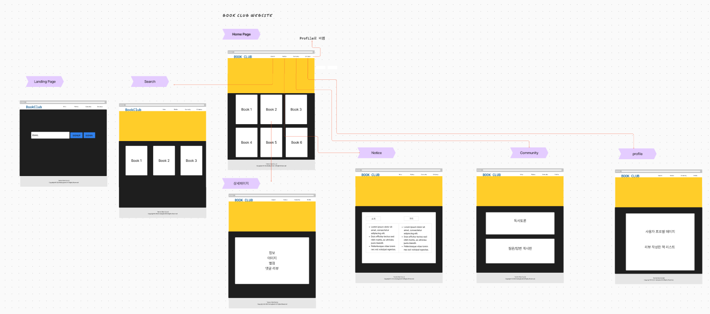

# Front_MiniProject_Library

프론트엔드 미니 프로젝트
<br>

## 1. 프로젝트 목표 및 범위

독서 커뮤니티 플랫폼으로 가입한 사용자들이 책을 중심으로 소통하고 정보를 공유할 수 있는 환경을 제공합니다.<br> **BookClub** is a community for book lovers to discover, share, and discuss their favorite books.<br>
<br>
"Read. Share. Connect."<br>
This slogan incorporates key aspects of a book club:<br>

- Reading books
- Sharing thoughts and reviews
- Connecting with others in the community

- 정보 마인드맵

- 서비스 흐름도:<br>
  메인 페이지<br>
  회원가입 및 로그인<br>
  책 정보 조회 및 검색<br>
  리뷰 작성 및 조회<br>
  독서 활동 기록<br>
  커뮤니티 활동 (게시글 작성, 댓글)<br>
  추가할 예정 :책 추천 받기<br>
  책 구매 (온라인 서점 연계)<br>
  소셜 기능 (팔로우, 공유)<br>

## 2. 기술 스택 및 배포 환경

Html/CSS | JavaScript | TypeScript | React | Bootstrap<br>

## 3. github repo, url 생성

Repo : https://github.com/helloghostt/Front_MiniPj_Library.git<br>
<https://mathdev-park.notion.site/BookClub-c855373c91684feb9f295db702f32091?pvs=4>

## 4. WBS 작성 - 업무 분류 체계


<br>

## 5. 와이어프레임 작성


<br>
| 도서 관리 | 사용자 상호작용 |
| ---------------------------------------------------------------------- | ------------------------------------------------------------------------------------------ |
| - 책 목록 관리<br>- 책 정보 제공<br>- 책 검색 기능<br>- 책 추천 시스템 | - 리뷰 작성/수정/삭제<br>- 댓글 및 대댓글 기능<br>- 추천/비추천 기능<br>- 인기순 정렬 옵션 |
| **커뮤니티 기능** | **사용자 계정** |
| - 독서 토론 게시판<br>- 독서 모임 개설/참여<br>- 책 관련 질문/답변 | - 회원가입<br>- 로그인 (일반/SNS)<br>- 프로필 관리<br>- 독서 활동 기록 |
| **추천 시스템** | **소셜 기능** |
| - 개인화된 책 추천<br>- 인기 도서 추천<br>- 유사 독자 추천 | - 팔로우/팔로잉<br>- 독서 활동 공유<br>- 친구와 책 추천 주고받기 |

<br>

## 6. ERD 작성

```mermaid
erDiagram

Table Users {
  id integer [primary key]
  username varchar
  email varchar
  password varchar
  created_at timestamp
  updated_at timestamp
}

Table Books {
  id integer [primary key]
  title varchar
  author varchar
  isbn varchar
  publication_year integer
  created_at timestamp
  updated_at timestamp
}

Table BookClubs {
  id integer [primary key]
  name varchar
  description text
  creator_id integer
  created_at timestamp
  updated_at timestamp
}

Table Memberships {
  id integer [primary key]
  user_id integer
  bookclub_id integer
  role varchar
  created_at timestamp
  updated_at timestamp
}

Table ReadingLists {
  id integer [primary key]
  bookclub_id integer
  book_id integer
  start_date date
  end_date date
  created_at timestamp
  updated_at timestamp
}

Table Posts {
  id integer [primary key]
  title varchar
  content text [note: 'Content of the post']
  author_id integer
  bookclub_id integer
  created_at timestamp
  updated_at timestamp
}

Table Comments {
  id integer [primary key]
  content text
  author_id integer
  post_id integer
  created_at timestamp
  updated_at timestamp
}

Ref: Users.id < BookClubs.creator_id
Ref: Users.id < Memberships.user_id
Ref: BookClubs.id < Memberships.bookclub_id
Ref: BookClubs.id < ReadingLists.bookclub_id
Ref: Books.id < ReadingLists.book_id
Ref: Users.id < Posts.author_id
Ref: BookClubs.id < Posts.bookclub_id
Ref: Users.id < Comments.author_id
Ref: Posts.id < Comments.post_id
```

<br>

## 7. 폴더구조

Front_MiniPj_Library/
└── mybookclub/
├── public/ <!-- font -->
├── src/
│ ├── components/ <!-- 재사용 가능한 UI컴포넌트 -->
│ ├── contexts/ <!-- react context api 상태 관리 로직 -->
│ ├── hooks/ <!-- react hook -->
│ ├── routes/ <!-- route 관련 component -->
│ │ ├── About/ <!-- 회사소개 페이지 컴포넌트 -->
│ │ ├── BookDetail/ <!-- 책 상세 정보 페이지 컴포넌트 -->
│ │ ├── Profile/ <!-- 사용자 프로필 페이지 컴포넌트 -->
│ │ ├── Community/ <!-- 커뮤니티 페이지 컴포넌트 -->
│ │ ├── LandingPage/ <!-- 메인 랜딩 페이지 컴포넌트 -->
│ │ └── Home/ <!-- 홈페이지-->
│ ├── services/ <!-- api -->
│ ├── types/ <!-- type정의  -->
│ └── styles/
└── App.tsx

## 8. URL 구조 및 페이지별 상세

- 화면리스트:

1. 회원가입/로그인 기능: LandingPage
2. 회사소개: AboutPage
3. 최신 리뷰, 인기 도서, 추천 도서 등을 보여주는 페이지: HomePage
4. 도서 검색 및 목록 페이지 검색 기능 : SearchBook
5. 책 정보, 별점, 구매 링크, 리뷰 CRUD기능 : BookDetail
6. 개인 정보, 작성한 리뷰 목록, 로그아웃 기능 : ProfilePage
7. 독서 관련 토론, 질문/답변을 위한 게시판, 댓글CRUD, 대댓글CRUD 기능 : Comunity

## 9. 페이지구현


## 10. 느낀 점

기한이 짧아 기능이 구현되지 못한 부분들에 대한 아쉬움이 남았습니다.
npm test에 대한 부분을 빼고 가야했고 부족한 부분이 많은 프로젝트입니다.
<br>

## 11. 트러블슈팅

1. TailwindCSS is not available : 여러가지 방법으로 재설치하고 전문가에게 도움도 요청해보았으나 단순한 install문제나 설치미흡에 대한 부분이 아닌 것으로 판단되어 bootstrap을 사용하여 개발 진행
   <br>

## 12. 저작권과 api

이미지는 picsum.photos, 아이콘 파인더(로고), 교보문고(책표지)에서 가져오거나
소장용 사진입니다.<br>
data를 따로 만들어서 구현한 다음 네이버 api 연결했습니다.
